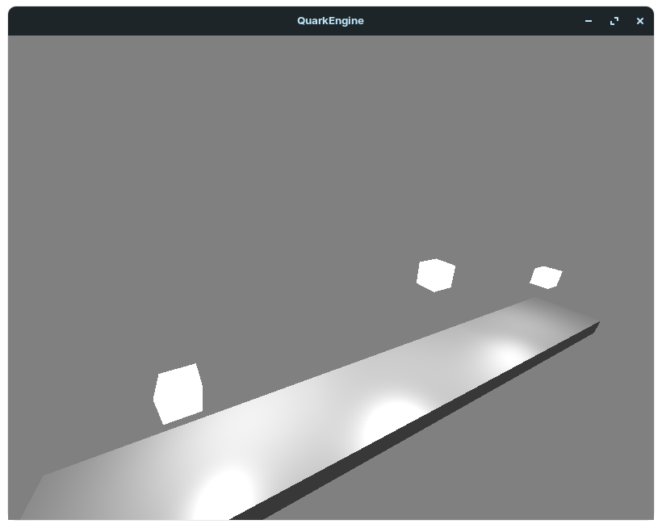
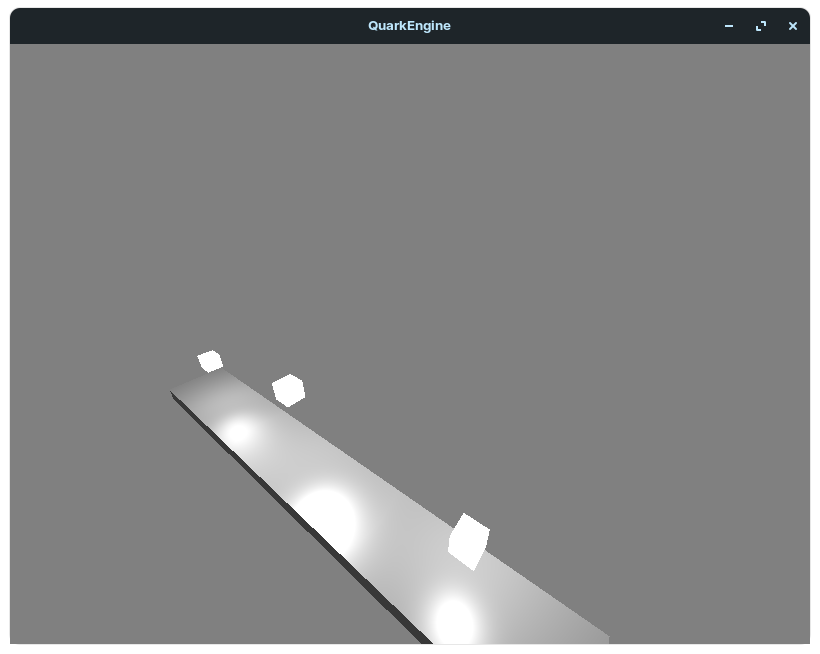
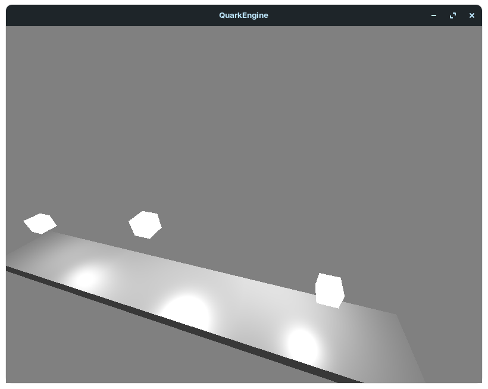

# QuarkEngine

QuarkEngine is a simple graphics engine written using OpenGL and GLFW, capable of real-time rendering of basic 3D
shapes. The `main.c` contains a simple program for demonstrative purposes.

## Features

- Three types of lighting: directional light, point light, and spotlight
- Object transformations: scaling, rotation about the global and local pivots, translation, and custom transformations
  via matrices
- Materials with configurable color, shininess, and light reflection
- Custom shapes: specified by normals, and vertices
- Basic mouse and keyboard (WASD) controls for moving in the scene.

## Demonstration

